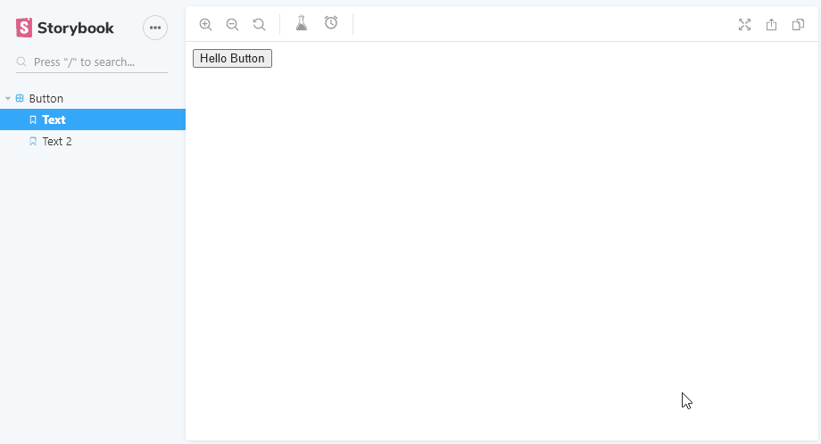

# node-typescript-boilerplate

An Addon to add a button from within any react functional component to the storybook toolbar.

> Note that this addon will only work with react app.



## Configuration

within `.storybook/main.js`:

```js
module.exports = {
  addons: ['storybook-addon-toolbar-actions/register'],
};
```

## Usage

within any functional component:

To add icon:

```js
import { useToolbarActions } from 'storybook-addon-toolbar-actions';
import AcUnitIcon from '@material-ui/icons/AcUnit';

export const WithIcon = () => {
  useToolbarActions(
    'icon-id',
    <AcUnitIcon style={{ fill: 'currentColor' }} />,
    () => {
      console.log('clicked');
    },
  );
  return <button />;
};
```

To add option list:

```js
import { useToolbarActions } from 'storybook-addon-toolbar-actions';
import AcUnitIcon from '@material-ui/icons/AcUnit';

export const WithOptions = () => {
  const [options, setOptions] = useState<ToolbarActionOption[]>([
    { key: 'name', value: 'val' },
    { key: 'name2', value: 'val' },
  ]);

  useToolbarActions(
    'icon-id',
    <AcUnitIcon style={{ fill: 'currentColor' }} />,
    (options, option) => {
      setOptions(options);
      console.log(option);
    },
    {
      closeOptionListOnClick: true,
      options,
    },
  );
  return <button />;
};
```

## Options

- active?: boolean;
- options?: ToolbarActionOption[];
- closeOptionListOnClick?: boolean;
- group?: string | number;
- setKnob?: boolean;
- multiChoice?: boolean;

### active

Will activate the storybook IconButton indicator.

### options

If set a dropdown list will be open under the button:

```js
useToolbarActions(
  'icon-id',
  <AcUnitIcon style={{ fill: 'currentColor' }} />,
  (option) => {
    console.log(option);
  },
  {
    closeOptionListOnClick: true,
    options: [{ title: 'name', value: 'val' }],
  },
);
```

### closeOptionListOnClick

Will close the option dropdown list when option clicked.

> When multiChoice set to `true` the `closeOptionListOnClick` option has no effect.

### group

Use this option to sort and group button in their container, when set the `Separator` will be added between button.

### setKnob

When set to `true` the id of action icon or option key/value will be set to knob.

### multiChoice

When set to `true` user can select multiple option.
